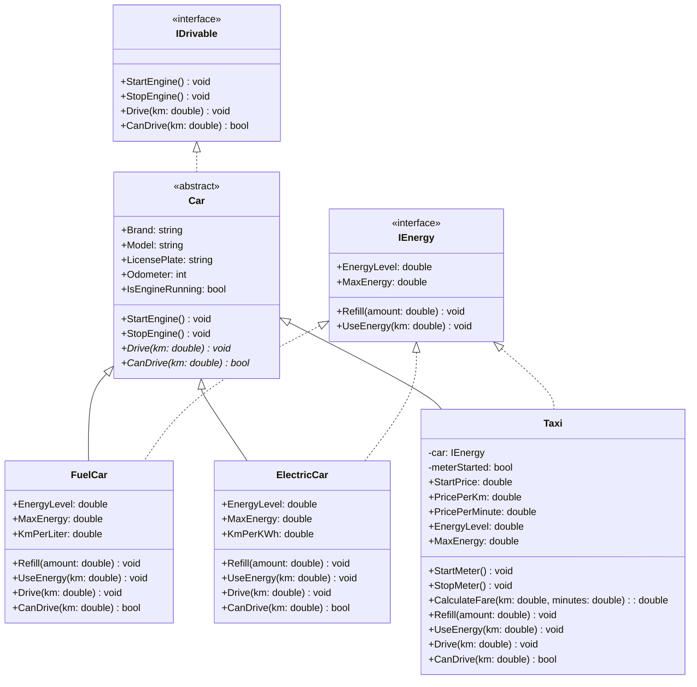

DCD in mermaid:

```mermaid
classDiagram
    class IDrivable {
        <<interface>>
        +StartEngine() void
        +StopEngine() void
        +Drive(km: double) void
        +CanDrive(km: double) bool
    }

    class IEnergy {
        <<interface>>
        +EnergyLevel: double
        +MaxEnergy: double
        +Refill(amount: double) void
        +UseEnergy(km: double) void
    }

    class Car {
        <<abstract>>
        +Brand: string
        +Model: string
        +LicensePlate: string
        +Odometer: int
        +IsEngineRunning: bool
        +StartEngine() void
        +StopEngine() void
        +Drive(km: double) void*
        +CanDrive(km: double) bool*
    }

    class FuelCar {
        +EnergyLevel: double
        +MaxEnergy: double
        +KmPerLiter: double
        +Refill(amount: double) void
        +UseEnergy(km: double) void
        +Drive(km: double) void
        +CanDrive(km: double) bool
    }

    class ElectricCar {
        +EnergyLevel: double
        +MaxEnergy: double
        +KmPerKWh: double
        +Refill(amount: double) void
        +UseEnergy(km: double) void
        +Drive(km: double) void
        +CanDrive(km: double) bool
    }

    class Taxi {
        -car: IEnergy
        -meterStarted: bool
        +StartPrice: double
        +PricePerKm: double
        +PricePerMinute: double
        +StartMeter() void
        +StopMeter() void
        +CalculateFare(km: double, minutes: double): double
        +EnergyLevel: double
        +MaxEnergy: double
        +Refill(amount: double) void
        +UseEnergy(km: double) void
        +Drive(km: double) void
        +CanDrive(km: double) bool
    }

    IDrivable <|.. Car
    Car <|-- FuelCar
    Car <|-- ElectricCar
    Car <|-- Taxi
    IEnergy <|.. FuelCar
    IEnergy <|.. ElectricCar
    IEnergy <|.. Taxi

```
